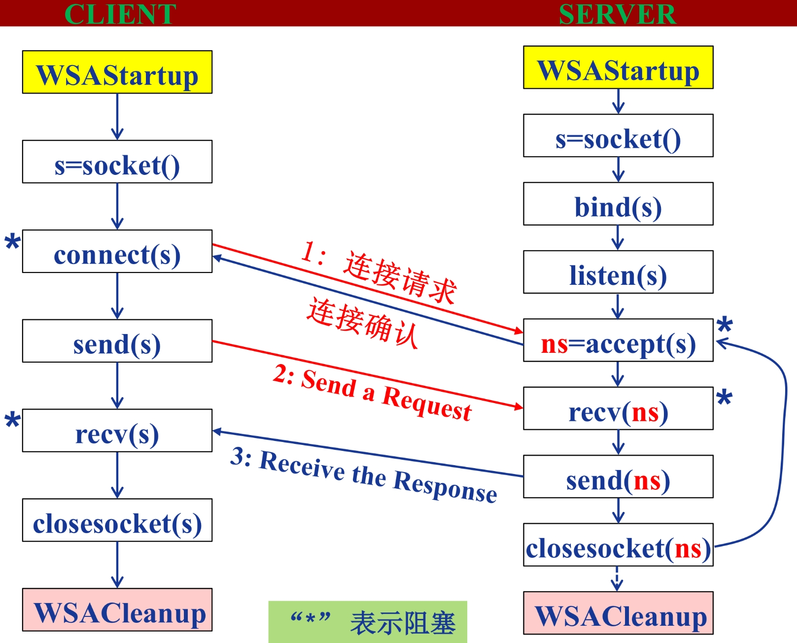

# Python 学习

## 小知识集合

- `__name__` 是当前模块名，当模块被直接运行时模块名为`__main__`。这句话表明当模块被直接运行时，以下代码将被运行，当模块是被导入时，代码块不被运行。

- python2 中可以使用python3 的语法，需要在代码前面加上 `from __future__ import XXX`，例如，用到python3中的print函数用法时，可以在代码前面写上 `from __future__ import print_function`。

- `pip install packages` 可使用国内镜像下载。

  ````python
  pip install -i https://pypi.tuna.tsinghua.edu.cn/simple packages
  ## 设置默认packages下载地址(此处选用的清华的镜像)
  pip install pip -U
  pip config set global.index-url https://pypi.tuna.tsinghua.edu.cn/simple
  ## 临时用镜像更新pip
  pip install -i https://pypi.tuna.tsinghua.edu.cn/simple pip -U
  ```

- `map()` 函数：根据提供的函数对指定序列做映射。第一个参数function以参数序列中的每一个元素调用function函数，返回包含每次function函数返回值的新列表。

  ```python
  map(function, iterable, ...)
  # function 函数 iterable 一个或多个序列
  ```

  


## 异常处理

- 异常即是一个事件，该事件会在程序执行过程中发生，影响了程序的正常执行。

- 一般情况下，在 Python 无法正常处理程序时就会发生一个异常。

捕捉异常可以使用 `try/except` 语句。

`try`语句的工作原理如下。

- 首先，执行 `try` 子句 （`try` 和 `except` 关键字之间的（多行）语句）。
- 如果没有异常发生，则跳过 `except` 子句并完成 `try` 语句的执行。
- 如果在执行 `try`子句时发生了异常，则跳过该子句中剩下的部分。然后，如果异常的类型和 `except` 关键字后面的异常匹配，则执行 `except` 子句 ，然后继续执行 `try` 语句之后的代码。
- 如果发生的异常和 `except` 子句中指定的异常不匹配，则将其传递到外部的`try`语句中；如果没有找到处理程序，则它是一个 *未处理异常*，执行将停止并显示如下所示的消息。

例子: 

```python
>>> try:
	x = int(input('请输入:'))
except ValueError:
	print('abcde') ### ValueError异常，执行该部分
else:
	print('12345') ### 无异常，则跳过 except 部分而执行该 else 部分

请输入:5
12345
请输入:a
abcde

>>> try:
	x = int(input('请输入:'))
except NameError:
	print('abcde')
else:
	print('12345')

请输入:a
Traceback (most recent call last):
  File "<pyshell#29>", line 2, in <module>
    x = int(input())
ValueError: invalid literal for int() with base 10: 'a'
```


### 不带任何异常类型

你可以不带任何异常类型使用except，如下实例：

```python
try:
    正常的操作
except:
    发生异常，执行这块代码
else:
    如果没有异常执行这块代码`
```

以上方式 `try-except` 语句捕获所有发生的异常。但这不是一个很好的方式，我们不能通过该程序识别出具体的异常信息。因为它捕获所有的异常。


###  带多种异常类型

你也可以使用相同的 `except` 语句来处理多个异常信息，如下所示：

```python
try:
    正常的操作
except(Exception1[, Exception2[,...ExceptionN]]):
   发生以上多个异常中的一个，执行这块代码
else:
    如果没有异常执行这块代码
```


### `try-finally` 语句

`try-finally` 语句无论是否发生异常都将执行最后的代码。

```python
try:
	<语句>
finally:
	<语句>    #退出try时总会执行
raise
```

例子:

```python
>>> try:
	x = int(input('请输入:'))
except ValueError:
	print('abcde')
else:
	print('12345')
finally:
	print('hello world')

请输入:a
abcde
hello world

>>> try:
	x = int(input('请输入:'))
except NameError:
	print('abcde')
else:
	print('12345')
finally:
	print('hello world')

请输入:a
hello world
Traceback (most recent call last):
  File "<pyshell#38>", line 2, in <module>
    x = int(input('请输入:'))
ValueError: invalid literal for int() with base 10: 'a'
```


###  `raise` 语句

`raise` 语句允许用户自行强制发生指定的异常。

例如:

```python
>>> raise NameError('Hello Wrong World')
Traceback (most recent call last):
  File "<pyshell#41>", line 1, in <module>
    raise NameError('Hello Wrong World')
NameError: Hello Wrong World
```


### python 标准异常

|         异常名称          |                        描述                        |
| :-----------------------: | :------------------------------------------------: |
|       BaseException       |                   所有异常的基类                   |
|        SystemExit         |                   解释器请求退出                   |
|     KeyboardInterrupt     |             用户中断执行(通常是输入^C)             |
|         Exception         |                   常规错误的基类                   |
|       StopIteration       |                 迭代器没有更多的值                 |
|       GeneratorExit       |        生成器(generator)发生异常来通知退出         |
|       StandardError       |              所有的内建标准异常的基类              |
|      ArithmeticError      |               所有数值计算错误的基类               |
|    FloatingPointError     |                    浮点计算错误                    |
|       OverflowError       |                数值运算超出最大限制                |
|     ZeroDivisionError     |            除(或取模)零 (所有数据类型)             |
|      AssertionError       |                    断言语句失败                    |
|      AttributeError       |                  对象没有这个属性                  |
|         EOFError          |             没有内建输入,到达EOF 标记              |
|     EnvironmentError      |                 操作系统错误的基类                 |
|          IOError          |                 输入/输出操作失败                  |
|          OSError          |                    操作系统错误                    |
|       WindowsError        |                    系统调用失败                    |
|        ImportError        |                 导入模块/对象失败                  |
|        LookupError        |                 无效数据查询的基类                 |
|        IndexError         |              序列中没有此索引(index)               |
|         KeyError          |                  映射中没有这个键                  |
|        MemoryError        |     内存溢出错误(对于Python 解释器不是致命的)      |
|         NameError         |            未声明/初始化对象 (没有属性)            |
|     UnboundLocalError     |               访问未初始化的本地变量               |
|      ReferenceError       | 弱引用(Weak reference)试图访问已经垃圾回收了的对象 |
|       RuntimeError        |                  一般的运行时错误                  |
|    NotImplementedError    |                   尚未实现的方法                   |
|        SyntaxError        |                  Python 语法错误                   |
|     IndentationError      |                      缩进错误                      |
|         TabError          |                   Tab 和空格混用                   |
|        SystemError        |                一般的解释器系统错误                |
|         TypeError         |                  对类型无效的操作                  |
|        ValueError         |                   传入无效的参数                   |
|       UnicodeError        |                 Unicode 相关的错误                 |
|    UnicodeDecodeError     |                Unicode 解码时的错误                |
|    UnicodeEncodeError     |                 Unicode 编码时错误                 |
|   UnicodeTranslateError   |                 Unicode 转换时错误                 |
|          Warning          |                     警告的基类                     |
|    DeprecationWarning     |               关于被弃用的特征的警告               |
|       FutureWarning       |           关于构造将来语义会有改变的警告           |
|      OverflowWarning      |        旧的关于自动提升为长整型(long)的警告        |
| PendingDeprecationWarning |              关于特性将会被废弃的警告              |
|      RuntimeWarning       |      可疑的运行时行为(runtime behavior)的警告      |
|       SyntaxWarning       |                  可疑的语法的警告                  |
|        UserWarning        |                 用户代码生成的警告                 |


## @装饰器

python 中@函数装饰器的工作原理。[该部分参考来源](http://c.biancheng.net/view/2270.html)。

假设用 $funA()$ 函数装饰器去装饰 $funB()$ 函数，如下所示：

```python
#funA 作为装饰器函数
def funA(fn):
	代码...   
	fn() # 执行传入的fn参数
    代码...    
	return '...'

@funA
def funB():
	代码
```

实际上，上面程序完全等价于下面的程序：

```python
def funA(fn):
	代码...
    fn() # 执行传入的fn参数
    代码...    
    return '...'
    
def funB():
	代码...
	
funB = funA(funB)
```

通过比对以上 2 段程序不难发现，使用函数装饰器 A() 去装饰另一个函数 B()，其底层执行了如下 2 步操作：

1. **将 B 作为参数传给 A() 函数**；
2. **将 A() 函数执行完成的返回值反馈回 B**。

例如：

举个实例：

```python
#funA 作为装饰器函数
>>>def funA(fn):
	print("人生苦短，我用Python")
    fn() # 执行传入的fn参数
    print("Hello wolrd")
    return "Good Ending"

>>>@funA
def funB():
	print("学习 Python")
    
##程序运行结果
人生苦短，我用Python
学习 Python
Hello World

>>> funB
Good Ending
```


## 进程和线程

进程是资源分配的最小单位，线程是CPU调度执行的最小单位

### 进程

进程(Process)是资源分配的最小单位，具有一定功能的程序 关于某个数据集合上的一次运行活动，进程是系统进行资源分配和调度的一个独立单位。每个进程都有自己的独立内存空间，不同进程通过进程间通信来通信。由于进程占独立内存，所以进程间的切换开销大。

### 线程 

线程(Thread)是进程的一个实体，是独立运行和独立调度的基本单位(CPU上真正运行的是线程)。

- 线程之间的通信更方便，同一进程下的线程共享全局变量，静态变量等数据。而进程之间的通信需要以 通信的方式进行
- 线程的调度与切换比进程快很多，同时创建一个线程的开销也比进程要小很多
- 多进程程序更稳定，多线程程序只要有一个线程死掉，整个进程也死掉了。

------

网上有些很形象的比喻：[阮一峰的博客](http://www.ruanyifeng.com/blog/2013/04/processes_and_threads.html)，[**转载自知乎用户biaodianfu**](https://www.zhihu.com/question/25532384/answer/411179772)

做个简单的比喻：进程=火车，线程=车厢

- 线程在进程下行进（单纯的车厢无法运行）
- 一个进程可以包含多个线程（一辆火车可以有多个车厢）
- 不同进程间数据很难共享（一辆火车上的乘客很难换到另外一辆火车，比如站点换乘）
- 同一进程下不同线程间数据很易共享（A车厢换到B车厢很容易）
- 进程要比线程消耗更多的计算机资源（采用多列火车相比多个车厢更耗资源）
- 进程间不会相互影响，一个线程挂掉将导致整个进程挂掉（一列火车不会影响到另外一列火车，但是如果一列火车上中间的一节车厢着火了，将影响到所有车厢）
- 进程可以拓展到多机，进程最多适合多核（不同火车可以开在多个轨道上，同一火车的车厢不能在行进的不同的轨道上）
- 进程使用的内存地址可以上锁，即一个线程使用某些共享内存时，其他线程必须等它结束，才能使用这一块内存。（比如火车上的洗手间）－"互斥锁"
- 进程使用的内存地址可以限定使用量（比如火车上的餐厅，最多只允许多少人进入，如果满了需要在门口等，等有人出来了才能进去）－“信号量”

------

### Multiprocessing 库

multiprocessing 是一个用与 threading 模块相似API的支持产生进程的包。multiprocessing 包同时提供本地和远程并发，使用子进程代替线程，有效避免 Global Interpreter Lock 带来的影响。

```python
from multiprocessing import Pool

def f(x):
    return x*x

if __name__ == '__main__':
    with Pool(5) as p:
        print(p.map(f, [1, 2, 3]))
        
>>> [1,4,9]  #输出
```

- `Process` 类

```python
class multiprocessing.Process(group=None, target=None, name=None, args=(), kwargs={}, *, daemon=None)
```

在 `multiprocessing`中，通过创建一个 `Process` 对象然后调用它的 `start()` 方法来生成进程。 `Process` 和 `threading.Thread` API 相同。 一个简单的多进程程序示例是:

```
from multiprocessing import Process

def f(name):
    print('hello', name)

if __name__ == '__main__':
    p = Process(target=f, args=('bob',))
    p.start()
    p.join()
```

要显示所涉及的各个进程ID，这是一个扩展示例:

```python
from multiprocessing import Process
import os

def info(title):
    print(title)
    print('module name:', __name__)
    print('parent process:', os.getppid())
    print('process id:', os.getpid())

def f(name):
    info('function f')
    print('hello', name)

if __name__ == '__main__':
    info('main line')
    p = Process(target=f, args=('bob',))
    p.start()
    p.join()
 
# 输出
main line
module name: __main__
parent process: 14993
process id: 26271
function f
module name: __main__
parent process: 26271
process id: 26762
hello bob
```

##### 进程间通信

`Process`之间肯定是需要通信的，操作系统提供了很多机制来实现进程间的通信。Python 的 `multiprocessing` 模块包装了底层的机制，提供了`Queue`、`Pipes`等多种方式来交换数据。

### Threading 库

Python3 线程中常用的两个模块为：

- **_thread**
- **threading(推荐使用)**

```python
threading.Thread(group=None, target=None, name=None, args=(), kwargs={})
```

下面是threading.Thread提供的线程对象方法和属性：

> - start()：创建线程后通过start启动线程，等待CPU调度，为run函数执行做准备；
> - run()：线程开始执行的入口函数，函数体中会调用用户编写的target函数，或者执行被重载的run函数；
> - join([timeout])：阻塞挂起调用该函数的线程，直到被调用线程执行完成或超时。通常会在主线程中调用该方法，等待其他线程执行完成。
> - name、getName()&setName()：线程名称相关的操作；
> - ident：整数类型的线程标识符，线程开始执行前（调用start之前）为None；
> - isAlive()、is_alive()：start函数执行之后到run函数执行完之前都为True；
> - daemon、isDaemon()&setDaemon()：守护线程相关；


## 浅复制和深复制

对于数字/字符/元组这种不可变值，增加改变等操作都会改变它的引用。对于字典/列表/集合这种可变值，增加删除等操作都不会改变它的引用。

```python
>>> a = 123 #数字int
>>> id(a)
140736147456080
>>> a = 1234
>>> id(a)
2612593870032 #引用已改变

>>> a = 'string' #字符string
>>> id(a)
2612623635440
>>> a += 'inhao'
>>> id(a)
2612626078256 #引用已改变

>>> a = [1,2,3] #列表list
>>> id(a)
2612625981320
>>> a.append(4)
>>> id(a)
2612625981320 #引用不改变

>>> a = {1:2} #字典dict
>>> id(a)
2612594022424
>>> a[2]=3
>>> id(a)
2612594022424 #引用不改变
```

- 直接赋值：其实就是对象的引用（别名）。

- 浅拷贝(copy)：拷贝父对象，不会拷贝对象的内部的子对象。

- 深拷贝(deepcopy)： copy 模块的 deepcopy 方法，完全拷贝了父对象及其子对象。

 例子：

```python
>>> import copy
>>> a = [1,2,3,['a','b']]
>>> b = a #赋值
>>> c = copy.copy(a) #浅复制
>>> d = copy.deepcopy(a) #深复制
>>> a.append(4)
>>> a[3].append('c')
>>> a
[1, 2, 3, ['a', 'b', 'c'], 4]
>>> b
[1, 2, 3, ['a', 'b', 'c'], 4]
>>> c
[1, 2, 3, ['a', 'b', 'c']]
>>> d
[1, 2, 3, ['a', 'b']]
```

 这里的列表b浅复制，只是复制了列表a中的引用，因为 a.append(4) 在原来的 a 中 ‘4’ 元素没有引用，所以列表 b 不会改变。（注意，如果输入命令 a[0]=1996，因为它原来复制的是 a[0] 的引用，而数值改变即 a[0]=1996 那么内存地址也变化了，所以列表 b 中仍不会改变），而列表 b 中的列表引用没有改变，还是列表 a 中列表['a','b']的引用，所以列表 a 中的列表改变，则列表 b 也随之改变。


```python
>>> a = b = 123 #数字
>>> id(a),id(b)
(140736147456080, 140736147456080)
>>> b = 1996
>>> a,b,id(a),id(b)
(123, 1996, 140736147456080, 2991010350544)
>>> a = b = '123' #字符
>>> id(a),id(b)
(2991010494960, 2991010494960)
>>> b = '1996'
>>> a,b,id(a),id(b)
('123', '1996', 2991010494960, 2991010495344)

>>> a = '你好啊' #字符
>>> b = a
>>> c = a[:]
>>> import copy
>>> d = copy.copy(a)
>>> e = copy.deepcopy(a)
>>> a,b,c,d,e
('你好啊', '你好啊', '你好啊', '你好啊', '你好啊')
>>> id(a),id(b),id(c),id(d),id(e)
(2991008171280, 2991008171280, 2991008171280, 2991008171280, 2991008171280)

>>> a = 1996 #数字
>>> b = a
>>> c = copy.copy(a)
>>> d = copy.deepcopy(a)
>>> a,b,c,d
(1996, 1996, 1996, 1996)
>>> id(a),id(b),id(c),id(d)
(2991010350480, 2991010350480, 2991010350480, 2991010350480)

>>> a = [1,2,3] #列表
>>> b = a
>>> c = copy.copy(a)
>>> d = copy.deepcopy(a)
>>> id(a),id(b),id(c),id(d)
(2315724705288, 2315724705288, 2315722286984, 2315724767112)
>>> a = {1,2,3} #集合
>>> b = a
>>> c = copy.copy(a)
>>> d = copy.deepcopy(a)
>>> id(a),id(b),id(c),id(d)
(2315724733576, 2315724733576, 2315724873800, 2315724874248)
>>> a = {1:23} #字典
>>> b = a
>>> c = copy.copy(a)
>>> d = copy.deepcopy(a)
>>> id(a),id(b),id(c),id(d)
(2315721054232, 2315721054232, 2315722298776, 2315724869704)

>>> a = 123 #数字
>>> b = a
>>> c = copy.copy(a)
>>> d = copy.deepcopy(a)
>>> id(a),id(b),id(c),id(d)
(140736147456080, 140736147456080, 140736147456080, 140736147456080)
>>> a = '123' #字符
>>> b = a
>>> c = copy.copy(a)
>>> d = copy.deepcopy(a)
>>> id(a),id(b),id(c),id(d)
(2315724810096, 2315724810096, 2315724810096, 2315724810096)
>>> a = (1,2,3) #元组
>>> b = a
>>> c = copy.copy(a)
>>> d = copy.deepcopy(a)
>>> id(a),id(b),id(c),id(d)
(2315724708904, 2315724708904, 2315724708904, 2315724708904)
```


### ==和is

```python
>>> a, b = 1, 1 #数字
>>> a == b
True
>>> a is b
True
>>> a, b= [1,2,3], [1,2,3] #列表list
>>> a is b
False
>>> a, b = (1,2,3), (1,2,3) #元组tuple
>>> a is b
False
>>> a, b = '123', '123' #字符string
>>> a is b
True
```

 尽管 value 一样，但当 a 和 b 是 tuple，list，dict 或 set 型时，a is b为 False。

- 数字和字符串时，`a is b` 为True.
  - 对于数字：python 初始化时会定义数字范围是-5～256的数值。在这个范围内的数值已经分配好了统一的内存地址。
  - 对于字符串：无论多么长的字符串都满足，但是不能有特殊字符。

## 内存管理/垃圾回收

参考：[链接1](http://c.biancheng.net/view/5540.html)，[链接2](https://baijiahao.baidu.com/s?id=1625794283727801503&wfr=spider&for=pc)，[链接3](https://www.cnblogs.com/alexzhang92/p/9416692.html)，[链接4](https://www.cnblogs.com/lurenjia1994/p/10498593.html)

Python 内部使用引用计数，来保持追踪内存中的对象，Python 内部记录了对象有多少个引用，即引用计数，当对象被创建时就创建了一个引用计数，当对象不再需要时，这个对象的引用计数为0时，它被垃圾回收。

测试占用内存的例子：

```python
import os
import psutil
# 显示当前 python 程序占用的内存大小
def show_memory_info(hint):
	pid = os.getpid()
    p = psutil.Process(pid)
    info = p.memory_full_info()
    memory = info.uss / 1024. / 1024
    print('{} memory used: {} MB'.format(hint, memory))
    
def func():
	show_memory_info('initial')
    a = [i for i in range(10000000)]
    show_memory_info('after a created')
    func()
    show_memory_info('finished')

>>> #输出结果
initial memory used: 47.19140625 MB
after a created memory used: 433.91015625 MB
finished memory used: 48.109375 MB
```


### 引用计数

查看一个对象的引用计数

```python
import sys
a = 'Hello World'
sys.getrefcount(a)
```

可以查看a对象的引用计数，但是比正常计数大1，因为调用函数的时候传入a，这会让a的引用计数+1。


#### 引用计数加1

1. 对象被创建：x=4

2. 另外的别人被创建：y=x

3. 被作为参数传递给函数：foo(x)

4. 作为容器对象的一个元素：a=[1,x,'33']

#### 引用计数减少情况

1. 一个本地引用离开了它的作用域。比如上面的 foo(x) 函数结束时，x 指向的对象引用减1。

2. 对象的别名被显式的销毁：del x ；或者del y

3. 对象的一个别名被赋值给其他对象：x=789

4. 对象从一个窗口对象中移除：myList.remove(x)

5. 窗口对象本身被销毁：del myList，或者窗口对象本身离开了作用域。

#### 引用计数机制

python 里每一个东西都是对象，它们的核心就是一个结构体：`PyObject`

```python
typedef struct_object {
    int ob_refcnt;
    struct_typeobject *ob_type;
} PyObject;
```

PyObject 是每个对象必有的内容，其中 ob_refcnt 就是做为引用计数。当一个对象有新的引用时，它的 ob_refcnt 就会增加，当引用它的对象被删除，它的 ob_refcnt 就会减少

```python
#define Py_INCREF(op)   ((op)->ob_refcnt++) //增加计数
#define Py_DECREF(op) \ //减少计数
    if (--(op)->ob_refcnt != 0) 
        ; 
    else
        __Py_Dealloc((PyObject *)(op))
```

当引用计数为0时，该对象生命就结束了。

##### 优点

- 简单
- 实时性：一旦没有引用，内存就直接释放了。不用像其他机制等到特定时机。实时性还带来一个好处：处理回收内存的时间分摊到了平时。

##### 缺点

- 维护引用计数消耗资源
- 循环引用

```python
list1,list2 = [], []
list1.append(list2)
list2.append(list1)
```

list1与list2相互引用，如果不存在其他对象对它们的引用，list1与list2的引用计数也仍然为1，所占用的内存永远无法被回收，这将是致命的。 对于如今的强大硬件，缺点1尚可接受，但是循环引用导致内存泄露，注定python还将引入新的回收机制。(标记清除和分代收集)

- 标记清除：此方式主要用来处理循环引用的情况，只有容器对象（list、dict、tuple，instance）才会出现循环引用的情况。


### 垃圾回收

1、当内存中有不再使用的部分时，垃圾收集器就会把他们清理掉。它会去检查那些引用计数为0的对象，然后清除其在内存的空间。当然除了引用计数为0的会被清除，还有一种情况也会被垃圾收集器清掉：当两个对象相互引用时，他们本身其他的引用已经为0了。

2、垃圾回收机制还有一个循环垃圾回收器, 确保释放循环引用对象(a引用b, b引用a, 导致其引用计数永远不为0)。

在Python中，许多时候申请的内存都是小块的内存，这些小块内存在申请后，很快又会被释放，由于这些内存的申请并不是为了创建对象，所以并没有对象一级的内存池机制。这就意味着Python在运行期间会大量地执行malloc和free的操作，频繁地在用户态和核心态之间进行切换，这将严重影响Python的执行效率。为了加速Python的执行效率，Python引入了一个内存池机制，用于管理对小块内存的申请和释放。


#### 小整数对象池

整数在程序中的使用非常广泛，Python为了优化速度，使用了小整数对象池， 避免为整数频繁申请和销毁内存空间。

Python 对小整数的定义是 [-5, 257) 这些整数对象是提前建立好的，不会被垃圾回收。在一个 Python 的程序中，所有位于这个范围内的整数使用的都是同一个对象.

同理，单个字母也是这样的。

但是当定义2个相同的字符串时，引用计数为0，触发垃圾回收。

#### 大整数对象池

每一个大整数，均创建一个新的对象。

```python
>>> a,b = 300,300
>>> id(a),id(b)
(1991892034320, 1991892034416)
>>> a,b = 200,200
>>> id(a),id(b)
(140722755439088, 140722755439088)
```

#### intern 机制

- 小整数[-5,257)共用对象，常驻内存
- 单个字符共用对象，常驻内存
- 单个单词，不可修改，默认开启intern机制，共用对象，引用计数为0，则销毁 

- 字符串（含有空格），不可修改，没开启intern机制，不共用对象，引用计数为0，销毁 

```python
>>> a,b = 'Hello World','Hello World'
>>> id(a),id(b)
(1991892047600, 1991892047088)
>>> a,b = 'HelloWorld','HelloWorld'
>>> id(a),id(b)
(1991892047216, 1991892047216)
```

- 大整数不共用内存，引用计数为0，销毁 
- 数值类型和字符串类型在 Python 中都是不可变的，这意味着你无法修改这个对象的值，每次对变量的修改，实际上是创建一个新的对象 


### 内存池机制

Python提供了对内存的垃圾收集机制，但是它将不用的内存放到内存池而不是返回给操作系统。

Python中所有小于256个字节的对象都使用 pymalloc 实现的分配器，而大的对象则使用系统的 malloc。另外Python对象，如整数，浮点数和List，都有其独立的私有内存池，对象间不共享他们的内存池。也就是说如果你分配又释放了大量的整数，用于缓存这些整数的内存就不能再分配给浮点数。


## MySQL

参考: [链接1](https://www.runoob.com/python3/python3-mysql.html)

### 数据库连接

连接数据库前，请先确认以下事项：

- 您已经创建了数据库 world。
- 在TESTDB数据库中您已经创建了表 City。
- City 表字段为 NAME, CONTINENT，POPULATION。
- 连接数据库 world 使用的用户名为 "root" ，密码为 "mysql1996",你可以可以自己设定或者直接使用root用户名及其密码，Mysql 数据库用户授权请使用Grant命令。

```python
#!/usr/bin/python3
import pymysql
# 打开数据库连接
db = pymysql.connect("localhost","root","mysql1996","wolrd" )
# 使用 cursor() 方法创建一个游标对象 cursor
cursor = db.cursor()
# 使用 execute()  方法执行 SQL 查询 
cursor.execute("SELECT VERSION()")
# 使用 fetchone() 方法获取单条数据.
data = cursor.fetchone()
print ("Database version : %s " % data)
# 关闭数据库连接
db.close()

>>> # 输出结果
Database version: 8.0.20
```


### 创建数据库表

如果数据库连接存在我们可以使用execute()方法来为数据库创建表，如下所示创建表CITY：

```python
#!/usr/bin/python3
import pymysql
# 打开数据库连接
db = pymysql.connect("localhost","root","mysql1996","world" )
# 使用 cursor() 方法创建一个游标对象 cursor
cursor = db.cursor()
# 使用 execute() 方法执行 SQL，如果表存在则删除
cursor.execute("DROP TABLE IF EXISTS CITY")
# 使用预处理语句创建表
sql = """CREATE TABLE CITY (
         NAME  CHAR(20) NOT NULL,
         CONTINENT  CHAR(20),
         POPULATION INT"""
cursor.execute(sql)
# 关闭数据库连接
db.close()
```

### 数据库插入操作

以下实例使用执行 SQL INSERT 语句向表  CITY 插入记录：

```python
#!/usr/bin/python3
import pymysql
# 打开数据库连接
db = pymysql.connect("localhost","root","mysql1996","world" )
# 使用cursor()方法获取操作游标 
cursor = db.cursor()
# SQL 插入语句
sql = """INSERT INTO CITY(NAME,
         CONTINENT, POPULATION)
         VALUES ('XXX', 'ASIA', 20000)"""
try:
   # 执行sql语句
   cursor.execute(sql)
   # 提交到数据库执行
   db.commit()
except:
   # 如果发生错误则回滚
   db.rollback()
# 关闭数据库连接
db.close()
```

### 数据库查询操作

Python 查询 Mysql 使用 fetchone() 方法获取单条数据, 使用 fetchall() 方法获取多条数据。

- **fetchone():** 该方法获取下一个查询结果集。结果集是一个对象
- **fetchall():** 接收全部的返回结果行.
- **rowcount:** 这是一个只读属性，并返回执行execute()方法后影响的行数。

```python
#!/usr/bin/python3
import pymysql
# 打开数据库连接
db = pymysql.connect("localhost","root","mysql1996","world" )
# 使用cursor()方法获取操作游标 
cursor = db.cursor()
# SQL 查询语句
sql = "SELECT * FROM city \
       WHERE POPULATION > %s" % (1000)
try:
   # 执行SQL语句
   cursor.execute(sql)
   # 获取所有记录列表
   results = cursor.fetchall()
   for row in results:
      name = row[0]
      continent = row[1]
      population = row[2]
       # 打印结果
      print ("name=%s,continent=%s,population=%s" % \
             (name,continent,population))
except:
   print ("Error: unable to fetch data")
# 关闭数据库连接
db.close()
```

### 数据库更新/删除操作

```python
#!/usr/bin/python3
import pymysql
# 打开数据库连接
db = pymysql.connect("localhost","root","mysql1996","world" )
# 使用cursor()方法获取操作游标 
cursor = db.cursor()
 
# SQL 更新语句
sql = "UPDATE CITY SET POPULATION = POPULATION + 1000 WHERE CONTINENT = 'ASIA'"
# SQL 删除语句
sql = "DELETE FROM CITY WHERE POPULATION > %s" % (2000)

try:
   # 执行SQL语句
   cursor.execute(sql)
   # 提交到数据库执行
   db.commit()
except:
   # 发生错误时回滚
   db.rollback()
# 关闭数据库连接
db.close()
```


## Socket编程

Python 提供了两个级别访问的网络服务：

- 低级别的网络服务支持基本的 Socket，它提供了标准的 BSD Sockets API，可以访问底层操作系统Socket接口的全部方法
- 高级别的网络服务模块 SocketServer， 它提供了服务器中心类，可以简化网络服务器的开发。

 Python 中，我们用 socket() 函数来创建套接字，语法格式如下：

```python
socket.socket([family[, type[, proto]]])
```

 参数

- family: 套接字家族可以使AF_UNIX或者AF_INET
- type: 套接字类型可以根据是**面向连接(TCP)的还是非连接(UDP)**分为SOCK_STREAM或SOCK_DGRAM
- protocol: 一般不填默认为0.

 **Python3.5.x socket只能收发字节内容，Python2.7可以直接发送字符串**

 

服务端代码 server.py：

```python
import socket
#初始化socket
s = socket.socket(socket.AF_INET, socket.SOCK_STREAM)
host = 'localhost'
# host = socket.gethostname() #获取本地主机名
port = 8001 设置端口号
s.bind((host,port)) #服务端绑定主机和端口
s.listen(5) #等待至多5个客户端连接
while True:
    connection,address = s.accept()
    connection.send('Hello world!'.encode('utf-8'))
    connection.close()
```

 客户端代码 client.py:

```python
import socket
s = socket.socket(socket.AF_INET, socket.SOCK_STREAM)
host = 'localhost'
#host = socket.gethostname()
port = 1234
s.connect((host,port))
print(s.recv(1024).decode('utf-8'))
s.close()
```

 现在我们打开两个终端，第一个终端执行 server.py 文件：`python server.py`

 第二个终端执行 client.py 文件：`python client.py` 

```
输出：Hello World!
```

 这时我们再打开第一个终端，就会看到有以下信息输出：

```
连接地址： ('127.0.0.1', 62461)
```

### Web 应用服务

```python
#!/usr/bin/env python
#coding:utf-8
import socket
def handle_request(client):
    buf = client.recv(1024)
    client.send("HTTP/1.1 200 OK\r\n\r\n".encode('utf-8'))
    client.send("Hello, World".encode('utf-8'))

def main():
    sock = socket.socket(socket.AF_INET, socket.SOCK_STREAM)
    sock.bind(('localhost',8080))
    sock.listen(5)

while True:
    connection, address = sock.accept()
    print(connection,address)
    handle_request(connection)
    connection.close()

if __name__ == '__main__':
    main()  
```

 打开浏览器发现
 


## 爬虫

